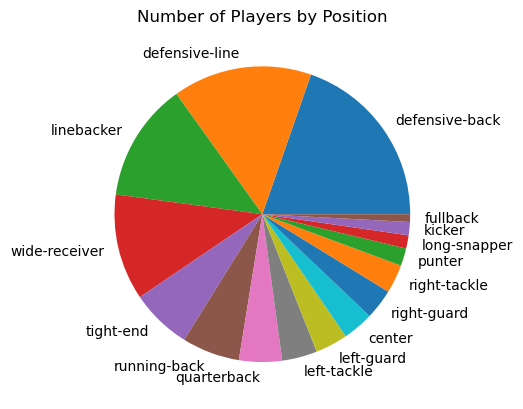

     Some people think that that proffesional atheletes make way to much money as opposed to other proffesions that are for the betterment of society such as doctors, teachers and rescue workers. While basketball is the highest paid sport with players average salary being around $11.91 million in the 2024-2025 season. However, due to my heavy instrest in football I decided to take a look at their salaries instead which is said to be the fith highest sport. 

    In my analysis I decided to take a look at the highest and lowest yearly salaries for football, in addition to the average salary for each position. My results showed that the lowest average salary was $495,500 and the highest average salary was $35,000,000. When looking at ceratin positions I found that the position with the highest average salary was for quarterbacks and the lowest average salary was for long-snapper. When comapring this to an average teacher salary in new york state which is around $92,000 which is a significant decrease compared to these players. So the question that arises with this is that is this pay gap justifiable?

    Some say that the higher salaries make sense since players provide a lot of entertainment and how they generate lots of money for the city. Others say this is because their careers are typically very short with them risking their bodies everyweek for the game. However, some people argue that these atheletes don't provide nearly as much value as proffesions such as doctors, teachers and rescue workers. This is backed up by Andrew Yang when he says, "We need to pay teachers more. It is an investment in ourselves". What this means is that teachers are such powerful and ifluential people and if we start to offer them better benefits then they will only become more influential. This is because NFL players are not neccesarly saving lives and treating others. 

    In my opinion based on my research I feel that these atheletes are paid the correct amount. This is because almost everyweek these players put themselves at risk of potientially ruining their careers and in some cases lives by getting hurt. "It's impossible for me to dissociate the risk of playing football from the risk of C.T.E", this is stated by neurologist Dr. Ann McKnee. This means that playing football in general puts you at a high risk of CTE. With CTE becoming more and more popular within the NFL, these players need to be ale to justify the risk of one of these injuries. That being said I also feel that jobs such as teachers should earn more since it is their responsibility to educate the next generation of people which is a very important job. 

